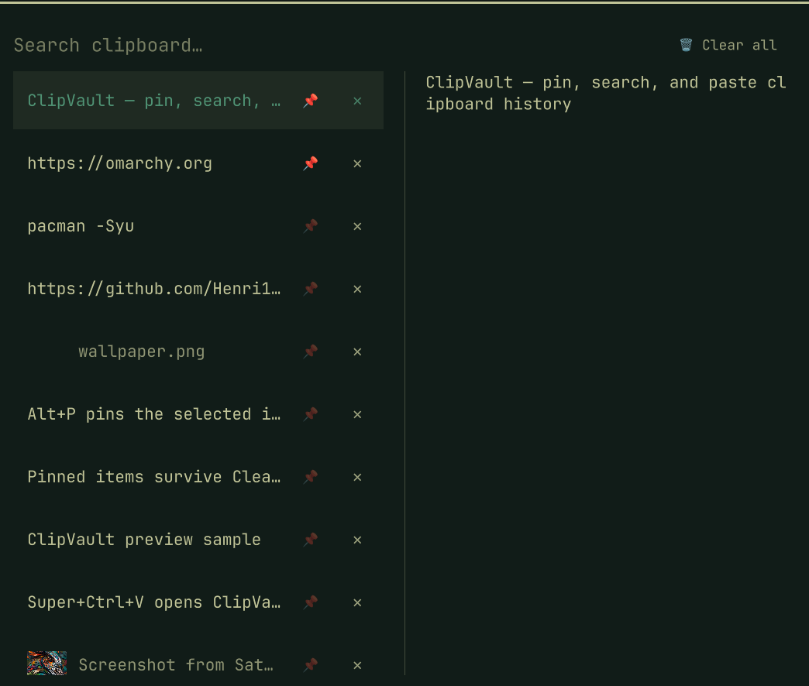

# ClipVault

Windows 11-style clipboard history for [Omarchy](https://omarchy.org/). Search, pin, preview images and files, and delete individual clips — without installing a second clipboard daemon.



> [!IMPORTANT]
> This plugin is for **Omarchy 4 (Quattro)**, where the desktop shell uses
> [Quickshell](https://quickshell.org/).

ClipVault is a drop-in replacement for the built-in `omarchy.clipboard` overlay. Enabling it automatically disables the stock plugin and keeps the default **Super+Ctrl+V** shortcut.

## What it does

- Searchable history of text, images, and copied files
- Pin items so they stay at the top and survive **Clear all**
- Unpinned history also persists across reboots (hybrid model)
- Two-pane popup: filtered list on the left, full preview on the right
- Per-row **📌** pin and **✕** delete buttons, plus **Clear all** in the header
- Uses Omarchy's existing clipboard paste helpers, so it stays on the same history file as the stock plugin
- History and screenshot files are private (`600` / `700`); history is written under `umask 077` so a save never leaves the file world-readable; pasted text is shown as plain text, not HTML

## Install

Review the repository, then add and enable the plugin:

```bash
omarchy plugin add https://github.com/Henri1130/omarchy-clipvault.git --enable
```

That one command clones the plugin, validates the manifest, enables it, and disables `omarchy.clipboard`. Super+Ctrl+V then opens ClipVault.

For an unattended install from a repository you already trust:

```bash
omarchy plugin add https://github.com/Henri1130/omarchy-clipvault.git --enable --yes
```

Restart the shell if the overlay does not appear after enabling:

```bash
omarchy restart shell
```

## Use

| Action | How |
| --- | --- |
| Open / close | `Super+Ctrl+V` |
| Filter | start typing |
| Paste selected | `Enter` or click the row |
| Copy selected (no paste) | `Shift+Enter` |
| Open file / image | `Alt+Enter` |
| Pin / unpin | `Alt+P` or click **📌** |
| Delete one item | `Delete` or click **✕** |
| Clear unpinned items | `Shift+Delete` or **Clear all** (asks first) |
| Close / clear search | `Esc` |

Pinned items float to the top. **Clear all** removes only unpinned entries.

## Update

```bash
omarchy plugin update henri.clipvault
```

## Disable

```bash
omarchy plugin disable henri.clipvault
```

This restores the built-in clipboard overlay.

## Uninstall

```bash
omarchy plugin remove henri.clipvault
```

Clipboard history in `~/.local/state/omarchy/clipboard-history.json` and image cache files in `~/.local/state/omarchy/clipboard-images/` are left in place so the stock plugin can keep using them.

## Validate from source

```bash
omarchy plugin validate .
node tests/test_clipboard_history.js
bash tests/test_save_history.sh
```

## Dependencies

Provided by Omarchy; nothing extra to install:

- `wl-clipboard` (`wl-paste` / `wl-copy`)
- `jq`
- `setpriv` (util-linux)
- Quickshell / Qt image support

## License

MIT. See [LICENSE](LICENSE).
